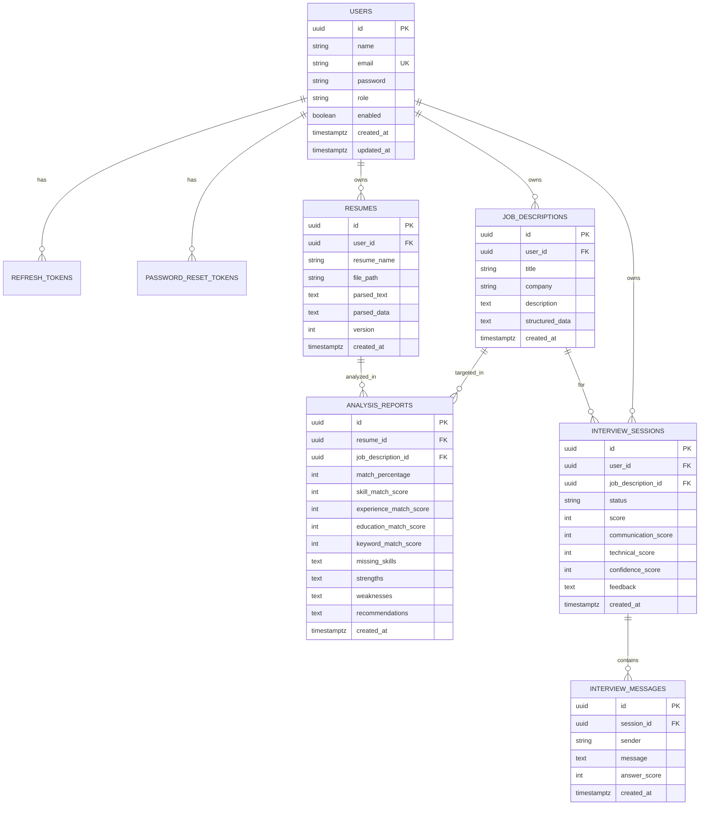

# Architecture & Data Model

## 1. System Overview

```
┌──────────────┐      HTTPS/JSON      ┌─────────────────────────────┐      JDBC      ┌────────────┐
│  React SPA   │ ───────────────────▶ │   Spring Boot REST API      │ ─────────────▶ │ PostgreSQL │
│ (Vite/nginx) │ ◀─────────────────── │  (stateless, JWT-secured)   │ ◀───────────── │            │
└──────────────┘                      └──────────────┬──────────────┘                └────────────┘
                                                     │ AiProvider (Strategy)
                                          ┌──────────┴───────────┐
                                          ▼          ▼           ▼
                                       Mock       OpenAI       Gemini
```

- **Frontend**: SPA, served statically by nginx which also reverse-proxies `/api` to the backend.
- **Backend**: stateless REST API. Every request is authenticated by a JWT bearer token validated in a `OncePerRequestFilter`.
- **Database**: schema owned by **Flyway** migrations; Hibernate runs in `validate` mode.
- **AI**: all generative calls go through the `AiProvider` interface, selected at runtime by config.

## 2. Backend Layering

Each feature package is split into clean layers, following SOLID and a strict dependency direction:

```
controller  →  service  →  repository  →  database
     │            │
     └── dto      └── domain (entities) / ai / storage
```

- **Controllers** are thin: validate input, delegate, wrap results in `ApiResponse`.
- **Services** hold business logic and transaction boundaries (`@Transactional`).
- **Repositories** are Spring Data JPA interfaces; ownership-scoped finders (`findByIdAndUserId`) enforce tenant isolation.
- **Mappers** (MapStruct / hand-written) convert entities ↔ DTOs so entities never leak over the wire.
- **Cross-cutting**: `GlobalExceptionHandler` (uniform errors), `ApiResponse`/`PageResponse` (uniform envelopes), `AppProperties` (typed config).

## 3. AI Provider Abstraction (Strategy Pattern)

```java
interface AiProvider {
    ParsedResume        analyzeResume(String resumeText);
    JobAnalysis         analyzeJobDescription(String jdText);
    SkillGapResult      analyzeSkillGap(String resumeText, String jdText);
    List<InterviewQuestion> generateQuestions(String resume, String jd, int count);
    String              startInterview(String resume, String jd);
    AnswerEvaluation    evaluateAnswer(List<ChatTurn> convo, String answer);
    InterviewFeedback   generateFeedback(List<ChatTurn> convo);
}
```

- `MockAiProvider` — deterministic, offline (default).
- `OpenAiProvider` / `GeminiProvider` — extend `AbstractLlmProvider`, which centralises prompt assembly + JSON parsing; subclasses implement only the single `complete()` HTTP call.
- `AiProviderResolver` injects all `AiProvider` beans into a name→bean map and returns the one named by `app.ai.provider`. **Adding a provider = one new class; switching = one config value.**

## 4. Storage Abstraction (Local → S3)

`StorageService` (`store/load/delete`) is implemented by `LocalStorageService` (filesystem, dev) and is designed for a drop-in `S3StorageService`:
- Resumes are referenced by an opaque **storage key**, never a public URL.
- Path traversal is guarded. To migrate to S3, implement `StorageService` over the AWS SDK and switch `app.storage.provider=s3`. No caller changes.

## 5. Security Model

- **Passwords**: BCrypt.
- **Access token**: short-lived JWT (HS256), subject = userId, custom `role` claim.
- **Refresh token**: opaque random value; only its **SHA-256 hash** is persisted, supporting rotation and revocation (logout / password reset revoke all).
- **Reset token**: same hash-at-rest approach, single-use, 30-min TTL.
- **Authorization**: stateless filter populates the `SecurityContext`; `/api/admin/**` requires `ROLE_ADMIN` (URL rule + `@PreAuthorize` defence-in-depth).

## 6. Entity-Relationship Diagram



## 7. Testing Strategy

- **Unit tests** (included): `MockAiProviderTest`, `JsonExtractorTest` — fast, no Spring context.
- **Integration tests** (recommended): add Testcontainers + a Postgres container so Flyway and JPA run against real Postgres:

```xml
<dependency>
  <groupId>org.testcontainers</groupId>
  <artifactId>postgresql</artifactId>
  <scope>test</scope>
</dependency>
```

Then `@SpringBootTest` + `@Testcontainers` with a `@ServiceConnection` Postgres container exercises controllers end-to-end.

## 8. Bonus Feature Roadmap

The schema and AI layer were designed to absorb the bonus features with minimal change:

- **Resume version tracking** — already modeled via `resumes.version`.
- **Career roadmap / salary prediction / job recommendation / cover-letter / LinkedIn review** — add `AiProvider` methods + thin services/controllers; the resolver and prompt-template pattern extend directly.
